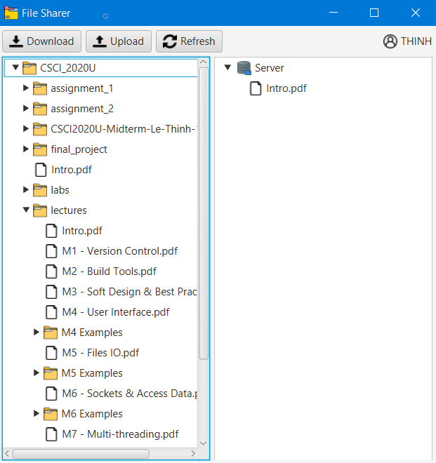

# File Sharing App

## Project Information:

A lightweight client-server file-sharing application that enables upload and download operations between multiple clients and a central server. Each client initiates a connection, issues a command, and disconnects once the task is complete. Supported commands include:

-   DIR:
    -   Retrieves and displays the contents of the server's shared directory.
    -   The server disconnects immediately after sending the file list.
-   UPLOAD filename:
    -   Transfers the specified file from the client to the server’s shared directory.
    -   The file is saved under the provided filename, and the server disconnects after the transfer is complete.
-   DOWNLOAD filename:
    -   Transfers the specified file from the server to the client’s local folder.
    -   The server disconnects after the file is sent.

### Server Details:

-   Headless (no UI) and multithreaded; each client request is handled in a separate thread.
-   Connections are short-lived and command-specific, ensuring efficient resource usage.
-   Supports uploading/downloading a wide range of file types (e.g., .txt, .pdf, .docx, .mp3, .mp4).
-   Allows navigation through subdirectories within the server’s shared directory.

### Client Details:

-   User-friendly interface featuring:
    -   Dual-pane file view: local directory (left) and server’s shared directory (right).
    -   Icons representing files and folders.
    -   "Refresh" button to manually update directory views.
    -   Automatic directory refresh every 10 seconds or after file transfers.
-   On startup, the client prompts the user to select a local folder.



## How To Run:

1. Install Java, which requires Java JDK version 8 or higher, [instruction](https://www.oracle.com/java/technologies/javase-downloads.html)
2. Install Gradle, recommend v6.8.3, [instruction](https://gradle.org/install/)
3. Clone this repository into your local machine, [instruction](https://docs.github.com/en/github/creating-cloning-and-archiving-repositories/cloning-a-repository)
4. Go into this repository in your local machine, and run the program with the following commands:
    - Run server:
      When the server is running, it will display the server IP address, and the server local directory (make sure the directory's name has **no space**)
    - Run client:
      Then it will display the directory chooser for the user to choose their local directory (make sure the directory's name has **no space**)

**Run server**

```
gradle start --args="<your server directory's path>"
```

**Run client**

```
gradle run --args="<the server's IP address>"
```

## Other Resources:
